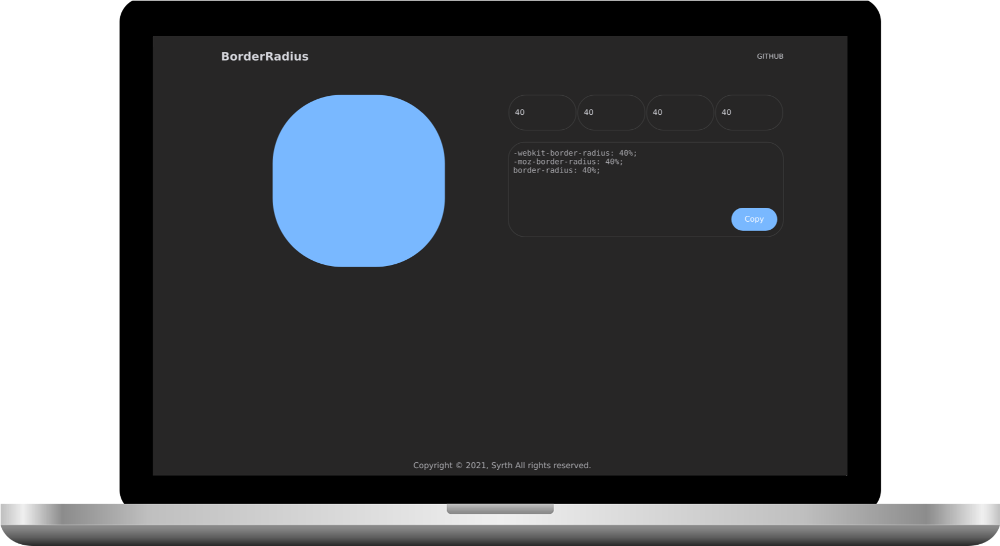

---

This generator will help you create the border-radius effects on your web pages.

## Technologies
- HTML5
- JAVASCRIPT
- SCSS

## License
Distributed under the `MIT License`. See LICENSE for more information.